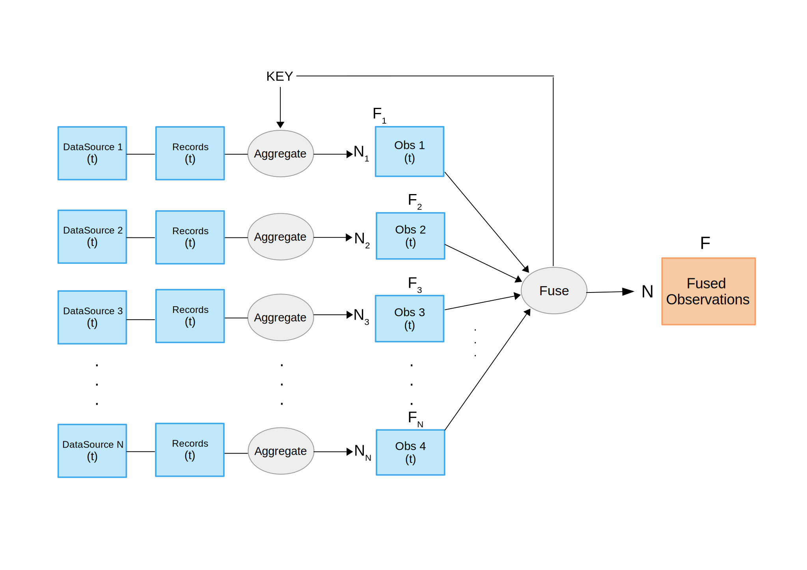
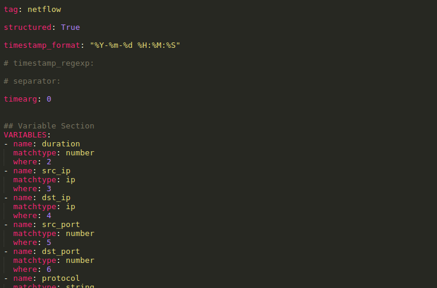
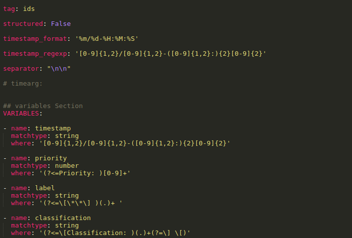

# FCParser User Manual


## 1. OVERVIEW

Raw data is not suitable for statistical analysis, parsing the data is needed in order obtain
observations for further analysis. FCparser is a tool that provides a comfortable, general
and highly configurable parsing of network data originating from different sources. It
has been designed to transform large amounts of heterogeneous network data into a
single matrix of data observations suitable for multivariate analysis, without losing
relevant information in the process. Also, it provides the opposite process of parsing:
_deparsing._ Using both detection and diagnosis information, the original raw data
records related to anomaly are identified and presented to the analyst.

## 2. PARSER

The parser transform heterogeneous data into observations arrays. This program is
designed to take any text based file as input, customizing configuration files
appropriately for each data source. Data sources, frequently logs from network and
security related programs, have an uneven format. They can be structured (e.g _csv_ files)
or unstructured (e.g one log entry each paragraph). With expertise in regular expression,
both of them can be handled with this parsing approach.

Feature as a counter ( _FaaC_ ) is the algorithm chosen to generate observations. Each
feature contains the number of times a given event (e.g the apparition of a word in a log
file) take place. This general definition makes it possible to handle most data sources
[1].

To provide flexibility to the tool, observation can be grouped to specific criteria. This is
called aggregation (e.g aggregate observation by source IP) and it is defined in
configuration file.


Figure 1: Block diagram of the parser


The program generates one file for each observation following this naming scheme:
_output-yyyymmddthhmm.dat._ Those files contains the observation array and aggregation
keys if they are used. Also, it generates a header file with a list feature names and a stats
file. The directory where these files are saved is defined in the general configuration
file.

Temporal sampling is an optional process included in the parsing program. This
procedure is performed by splitting input files into smaller files, each of those contains
log entries from a specific time window. Time window and other splitting parameters
are defined in the general configuration file.

### 2.2. CONFIGURATION FILES

The program is fully configurable using only configuration files. These files are in
YAML (YAML Ain't Markup Language) format. YAML is a human friendly data
serialization standard for all programming languages. For python, YAML files are
loaded as nested dictionaries depending on the indentation. In FCParser, there are two
kinds of configuration files: general configuration file and data sources configuration
files.

The General configuration file contains the main information for the parsing process:
datasources, aggregation keys, output directories and split configuration. An empty
general configuration file look like this:

**DataSources** : In this field, different data sources must be specified. For each data
source, the name, the configuration file of that data source and where the data have to
be specified. Input data can be in _csv_ format, text based log files or _nfcapd_ binary data.

**Keys:** In this field, none, one or more aggregation keys are defined. These keys are the
variables chosen to aggregate observation. For each unique value of said keys,
conservation are grouped (e.g source IP: for each unique value of source ip one


Figure 2: General configuration file


observartion of features is generated). Aggregation keys must be variables from the data
sources. If the chosen aggregation key is not a variable for a data source, that data
source won’t be parsed. If the field is empty, aggregation will not occur.

**Output:** In this field the output directory for the parsed data and the stats file are
defined.

**Deparsing_output:** In this field the output directory for the _deparsed_ raw data and the
stats file are defined. This configuration is only used for _deparsing_ process.

**Split:** In this field, the temporal sampling parameters are specified. Time window in
seconds, start time and end time. Time parameters format is YYYY-MM-DD hh:mm:ss.
For the correct functioning of this tool, time windows has to be multiple of 60 seconds.

Data sources configuration files are designed to easily adapt different data sources to the
program without knowledge of the internal programing. An empty data source
configuration file look like this:


Figure 3: Data source configuration file


**Attributes:**

- Tag: Key to identify data source, it is recommended to use simple tags (e.g _fw_
    for firewall).
- Structured: boolean bar to identify if a source is structured or unstructured.
- Timestamp_format: timestamp format for the logs in the files of the data source
    in python datetime format [2].
- Timestamp_regexp: regular expresion that matches the date format of the source
    (only needed for unstructured sources).
- Separator: Chars that delimits the log entries of the source (only needed in
    unstructured sources).
- Timearg: position of the timestamp in the log entry (only needed in structured
    sources).

**Variables:** Variables are fields that are extracted from a log entry (e.g source ip,
destination port, etc). Variables attributes differs depending if the data source is
structured or not, but the skeleton remains the same. For structured sources, raw data is
extracted from a determined position (e.g fourth field of a _csv_ entry). For unstructured
source, fields are extracted with regular expression.

Variable name is the name chose by the user. _Matchtype_ is the type of the field extracted
(e.g string, number, ip, etc); for structured sources, is the type of the raw data stracted;
for unstructured sources, _matchtype_ is the type of the match for the regular expression.
_Where_ is the key to find the field. For structured sources, is the position of the field,
while for unstructured sources, _where_ is the regular expression that match the wanted
field. An example can be found in the Example section.

## 3. DEPARSER

Using both detection and diagnosis information, the original raw data records related to
anomaly are identified and presented to the analyst. This process is called _deparsing_ and
it’s a straight forward process, that reduce the challenge of searching logs, surgically
extracting data related to anomalies.

The program uses the same configuration files that the parser and reverse the parsing
criteria. It takes as input a list of timestamps and a list of features and outputs a file of
log entries, that contains those features, and occurred in those timestamps.

To delimit the amount of log entries extracted, there is a threshold of log entries that are
extracted. Log entries that contains more selected features are prioritized. However, this
threshold is not absolute, log entries with the same amount of features should not be
dismissed. For this reason, the threshold is checked after processing and entire block of
log entries with the same number of features appearances.


The input file format is adapted to the output of the MEDA-Toolbox [3]. This toolbox is
a tool that can be utilized to analyze the parsed data. The format of the _deparsing_ input
file look like this:

## 4. EXAMPLE

### 4.1. PARSING

An example with structured and unstructured sources can be found with the FCParser in
the _Example_ directory. Data sources for this example are _netflow_ (structured, _csv_ files)
and _ids_ logs(unstructured log entries, one log each paragraph). Fig. 5 shows the general
configuration file for the example. In the upper part, there is the data sources
configuration with _netflow_ and ids as it was said. Keys is unused, so, aggregation is not
performed, therefore, observations will be grouped by timestamp. At the end of the file,
there is the configuration for temporal sampling. In this case, the sampling rate is one
minute.


Figure 4: Format of deparsing input file


Figure 5: Example general configuration file


In Fig. 6 there is a fragment of the configuration file for a _netflow_ data source. It shows
the mandatory attributes for a structured sources. Also, examples of variables for a
structured source. In this case, _where_ attribute indicates the position of the variable in
the log entry.


Figure 6: Example: netflow configuration file


Figure 7: Example: ids configuration file


In Fig. 7, an unstructured source configuration file is shown. The mandatory attributes
differs from the ones mandatory in _netflow_ configuration file(structured source). For
these kind of sources, regular expresions are needed to extract data. These regular
expressions are used to search variables in log entries.

In order to run the example and parse the data, just run the following command in the
FCParser directory:

```
$ python parser/parser.py Example/config/configuration.yaml
```
It outputs the header file, with a list of features from all data sources, the stats file and
the parsed data with the timestamp in the file name (output-yyyymmddthhmm.dat).

### 4.2. DEPARSING

The _deparsing_ process uses the same configuration files used before. Using both
detection and diagnosis information, the original raw data records related to anomaly
are identified and presented to the analyst. Detection and diagnosis information is
specified in the _deparsing_ input file. To run the program, use the following command:

$ python deparser/deparser.py Example/config/configuration.yaml
Example/deparsing_input

The _deparsing_ program generates one file for each data source with the extracted logs
related to the anomalies detected.


## 5. INSTALLATION REQUIREMENTS

FCParser is designed to work on UNIX system with python installed. Almost every
linux distribution come with python pre-installed. For library compatibility, python 2.
is the chosen version.

The program requires some python modules to work properly. Before using this tool,
install the following packages:

- Ipy – Python module for handling _IPv4_ and _IPv6_ addresses and networks [4]
    $ pip install IPy
- PyYAML – _YAML_ analyzer for python [5].
    $ pip install PyYAML

Nfdump [6]_._ In order to work with _netflow_ data in _nfcapd_ format, the _netflow_ processing
tool _Nfdump_ is required.


## REFERENCES

[1] Camacho, José & Pérez-Villegas, Alejandro & García-Teodoro, Pedro & Maciá-
Fernández, Gabriel. (2016). PCA-based multivariate statistical network monitoring for
anomaly detection. Computers & Security. 59.. 10.1016/j.cose.2016.02.008.

[2] Python datetime module for manipulating dates and times. Available at:
https://docs.python.org/2/library/datetime.html

[3] Camacho, J., Pérez, A., Rodríguez, R., Jiménez-Mañas, E. Multivariate Exploratory
Data Analysis (MEDA) Toolbox. Chemometrics and Intelligent Laboratory Systems,
2015, 143: 49-57, available at: https://github.com/josecamachop/MEDA-Toolbox

[4] _IPy_ , python module for handling of IPv4 and IPv6 addresses and networks.
Available at: https://pypi.python.org/pypi/IPy/

[5] _PyYAML_ , The next generation _YAML_ parser and emitter for Python. Available at:
https://pypi.python.org/pypi/PyYAML

[6] _NFDUMP_ , tools to collect and process _netflow_ data on the command line. Available
at: [http://nfdump.sourceforge.net/](http://nfdump.sourceforge.net/)


