# FCParser User Manual


## 1. OVERVIEW

Raw data is not suitable for statistical analysis, parsing the data is needed in order to obtain
observations for further analysis.
FCparser is a tool that provides a comfortable, general and highly configurable parsing of network data
originating from different sources. It has been designed to transform large amounts of heterogeneous network data into a
single matrix of data observations suitable for multivariate analysis, without losing
relevant information in the process. Also, it provides the opposite process of parsing:
_deparsing._ Using both detection and diagnosis information, the original raw data
records related to anomaly are identified and presented to the analyst.


## 2. PARSER

The parser transform heterogeneous data into observations arrays. This program is
designed to take any text based file as input, alongside configuration files appropriately customized for each data source.
Data sources, such as logs from network and security related programs, have an uneven format.
They can be structured (e.g _csv_ files) or unstructured (e.g one log entry each paragraph).
With expertise in regular expressions, both of them can be handled with this parsing approach.

Feature as a counter ( _FaaC_ ) is the algorithm chosen to generate observations. Each
feature contains the number of times a given event (e.g the presence of a word in a log
file) takes place. This general definition makes it possible to handle most data sources
[1].

To provide flexibility to the tool, observation can be grouped according to specific criteria. This is
called aggregation (e.g aggregate observation by source IP) and it is defined in general configuration file.

<p align="center"> 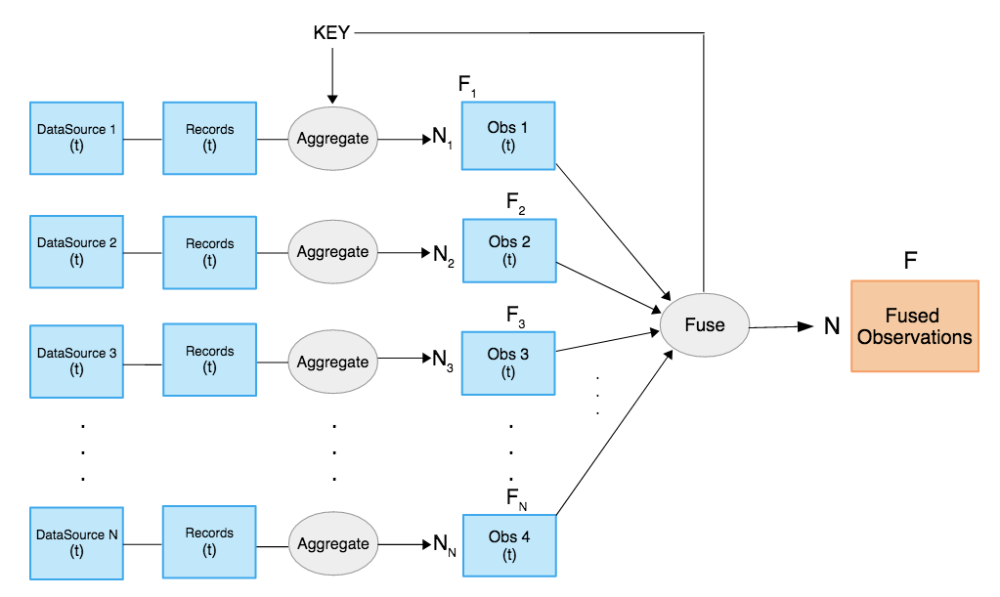 </p>
<div align="center"><i>Figure 1: Block diagram of the parser</i></div><br /> 

Temporal sampling is a process included in the parsing program. This
procedure is performed by splitting input files into smaller files, each of those contains
log entries from a specific time window. This way, output files (counters) will be grouped
according the temporal sampling configuration.
Time window and other splitting parameters are defined in the general configuration file as well.

The program then generates one file for each observation following this naming scheme:
_output-yyyymmddhhmm.dat_, according to the specified time window. Those files contain the observation array and aggregation
keys if they are used. Also, the program generates a header file with a list feature names and a stats
file. The directory where these files are saved is defined in the general configuration
file.

### 2.1. GENERAL CONFIGURATION FILE

The program is fully configurable using only configuration files. These files are in
YAML (YAML Ain't Markup Language) format. YAML is a human friendly data
serialization standard for all programming languages. For python, YAML files are
loaded as nested dictionaries depending on the indentation.  
In FCParser, there are two kinds of configuration files: <ins>general configuration file</ins> and
<ins>data sources configuration files</ins>.

The General configuration file contains the main information for the parsing process:
datasources, aggregation keys, output directories and split configuration, along with some processing parameters.
An empty general configuration file look like this:

<p align="center"> 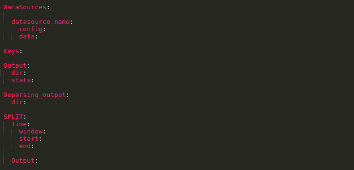 </p>
<div align="center"><i>Figure 2: General configuration file [configuration.yaml]</i></div><br />

**DataSources**: In this field, different data sources must be specified. For each data
source, the name, the specific configuration file for that data source and the data path have to
be specified. Input data can be in _csv_ format, text based log files or _nfcapd_ binary data.

**Keys:** In this field, none, one or more aggregation keys are defined. These keys are the
variables chosen to aggregate observation. For each unique value of said keys,
conservation are grouped (e.g source IP: for each unique value of source ip, one observation of features is generated). Aggregation keys must be variables from the data sources. If the chosen aggregation key is not a variable for a data source, that data source won’t be parsed.
If the field is empty, aggregation will not occur, so it is analyzed by timestamp by default.<br />
In case you define two data sources in the configuration file, please note that keys variables must be present in both data sources configuration files so that aggregation keys work. If it is not the case, you have to parse every data source independently. Therefore, this is the recommended way to do it when using the keys parameter in order to avoid possible errors.<br />
You can see how the data is parsed using keys by checking the Example chapter.

**Online**: Boolean variable to determine if online or offline mode. Online mode is set for real time application
              (only one process) while offline mode is used for processing already stored data sets (multiprocess).

**Processes**: Number of processes used by the program. Use a number between 1 and the number of cores of your system. You can know this number by executing lscpu command in linux and checking CPU(s) field, or by checking logical processors in TaskManager>performance tab in Windows.
If this parameter is not specified, 80% of maximum possible cores of the system will be set as the default value.

**Split:** In this field, the temporal sampling parameters are specified. Time window in
minutes, as well as start time and end time for sampling interval. Time parameters format must be YYYY-MM-DD hh:mm:ss.
If no time window is defined, 5 minutes is considered as the default value.

<p align="center">-Parsing parameters-</p>

**Parsing_Output:** In this field, the output directory for the parsed data and the stats file (which contains lines, records, matches) and weights file
are defined. Headers.dat (containing a list of feature names) and weights.dat files are generated by default if no names are specified.

**Incremental_output**: Boolean parameter for incremental features. If true and output files exist, new counters are added to the old ones. The default value for this parameter is False in case it is not defined. 

**All**: Boolean variable to consider either all possible matches for a variable or only the first one. It is set to False (consider only first match) by default. This parameter is important when dealing with certain kind of unstructured sources in which the regular expression for a variable might match more than one entity in our data. Therefore, All parameter should be set to True in the configuration file for these scenarios.

**Max_chunk**: Maximum chunk size in megabytes. When processing every data file, it is splitted into chunks for parallel processing. Each chunk size is usually calculated as the max_chunk size parameter divided by the number of cores used. If the max_chunk parameter is not defined, chunks of 1GB are considered by default.
Note that smaller chunks can slow down the parsing process while larger chunks would increase the processing speed but might overload your memory. Therefore, if the data size is not too big according to your free memory, it is highly recommendable to set up the highest possible value for max_chunk parameter, as it is depicted in the next figure for an example dataset of 1GB (netflow data).

<p align="center"> 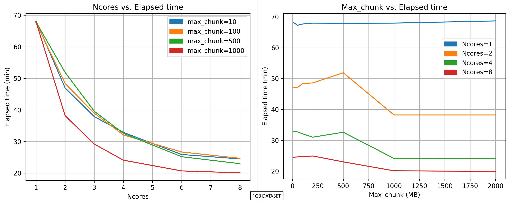 </p>
<div align="center"><i>Figure 3: Parsing performance test according to the Ncores and Max_chunk configuration parameters</i></div><br />

<p align="center">-Deparsing parameters-</p>

**Deparsing_output:** In this field the output directory for the _deparsed_ raw data and the
stats file are defined. This configuration is only used for _deparsing_ process.

**Threshold:** The upper limit of log entries per datasource that will appear in the output files. This threshold is not absolute so that all the logs with the same number of matched features will be considered. Check the examples in Debugger section or Example section for more detail.

<p align="center">-Learning parameters-</p>

**Lperc/Endlperc**: Proportion (percentage) of data used for learning.

### 2.2. DATA SOURCES CONFIGURATION FILES

Data sources configuration files are designed to easily adapt different data sources to the
program without knowledge of the internal programing. They are located in the same directory along the general configuration file.

The structure of these configuration files is shown in Figure 4:

<p align="center"> 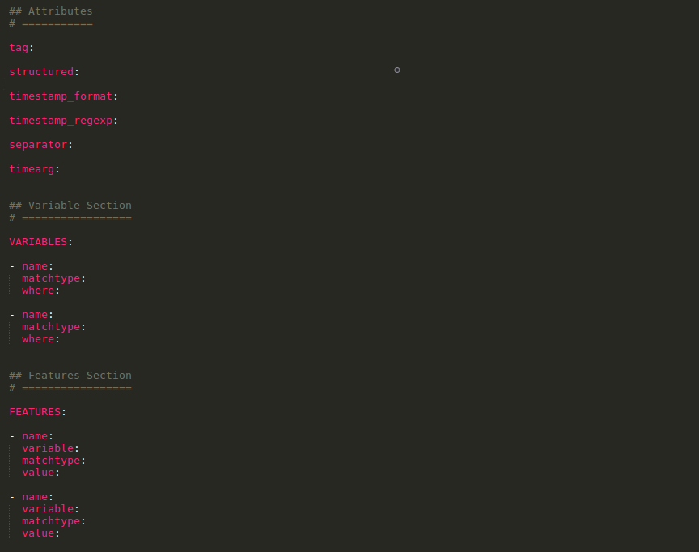 </p>
<div align="center"><i>Figure 4: Data Source configuration file</i></div><br />

**<ins>Attributes:</ins>**

- _Tag_: Key to identify data source, it is recommended to use simple tags (e.g _fw_
    for firewall).
- _Structured_: boolean variable to identify if a source is structured or unstructured.
- _Timestamp_format_: timestamp format for the logs in the files of the data source
    in python datetime format [2].
- _Separator_: Char that delimits the log entries of the source, i.e, the separator between records. It is mandatory for unstructured sources while for structured sources /n is considered if none is specified.
- _Timearg_: Timearg is the name of the timestamp variable. If the timearg attribute is not defined, the timestamp will be considered to be defined in a variable named 'timestamp'.
- _nfcapd_: Boolean parameter to indicate data source files with nfcapd format. In this case, data files will be preprocessed before parsing process, generating .csv files for this source. If this parameter is not defined, it is set to False by default (no nfcapd).

**<ins>Variables:</ins>** Variables are fields that are extracted from a log entry (e.g source ip,
destination port, etc). Variables attributes differ depending if the data source is
structured or not, but the skeleton remains the same.
For structured sources, raw data is extracted from a determined position (e.g fourth field of a _csv_ entry).
For unstructured source, fields are extracted with regular expressions.

- _Name_: Variable name chosen by the user.
- _Matchytype_ is the type of the field extracted (string, number, ip, time or duration).
  For structured sources, it is the type of the raw data extracted, whereas for unstructured sources,
  _matchtype_ is the type of the match for the regular expression.
- _Where_ is the key to find the field. It is the position of the field in the line (first position corresponds
  to zero value) for structured sources, while for unstructured sources it is the regular expression that match the wanted
field.

A clear explanation of these variable fields can be found in the Example section.

**Note:** There must be a variable (whose name is defined in timearg attribute) which collects the timestamps, and it must be defined as time matchtype.

**<ins>Features:</ins>** Based on the defined variables, different features are specified in order to be considered afterwards during multivariate analysis. For instance, if a variable src_port is extracted from logs, multiple features can be created depending on the value of that variable. Thus, we might have features such as port_http, port_ssh or port_smtp if the value of the variable src_port in logs matches 80, 22 or 25, respectively.
Thus, some fields must be specified:
- _Name_: Feature name chosen by the user.
- _Variable_: Name of the variable from which the feature is calculated.
- _Matchtype_: Kind of association between the variable and the feature:
    - _Single_: The feature is defined for a specific value of the variable.
    - _Multiple_: When multiple values of a variable match the same feature.
    - _Range_: The feature is represented by all the values within a specific range.
    - _Default_: Useful for considering different values than those previously defined. So, value field will be empty for this case.
    - _Regexp_: It is used when dealing with unstructured sources. Value field will match a certain string.
- _Value_: Depending on the matchtype field, one or more values will be defined. Value is empty if matchtype is default.
- _Weight_: Optional parameter to assign different weights to the features. It might be useful for deparsing process.
If weight is not specified for a feature, it is automatically set to one.

Note: A script creatconf.py is also given in config directory in order to build a FCParser config file for a data source out of a json with counts. This is useful to automatically decide the features of the system. Also, fclearning in bin directory.


## 3. DEPARSER

Using both detection and diagnosis information, the original raw data records related to
anomaly are identified and presented to the analyst. This process is called _deparsing_ and
it is a straight forward process, that reduce the challenge of searching logs, surgically
extracting data related to anomalies.

The program reverses the parsing criteria. It takes as input the same configuration files used by the parser,
along with an input file where a list of timestamps and a list of features are specified.
It outputs, for each data source, a file including the log entries that contains those features and occurred in those timestamps.  
The logs can match a different number of features, so several output files might be generated for a datasource, classified according to their number of matched features.

To delimit the maximum number of total log entries extracted for every data source, the threshold parameter is considered, which is defined in the general configuration file.
Log entries that contain more selected features are prioritized. However, this
threshold is not absolute and log entries with the same amount of features should not be
dismissed. For this reason, the threshold is checked after processing an entire block of
log entries with the same number of features appearances.
Thus, when running fcdeparser, a ordered list with the number of logs matching the defined features is printed. According to this list and the specified threshold, the minimum number of matched features in the logs that will be extracted is decided. Check the example section to see the decision criteria clearly.

The input file format is adapted to the output of the MEDA-Toolbox [3]. This toolbox is
a tool that can be used to analyze the parsed data. The format of the _deparsing_ input
file look like this:

<p align="center"> 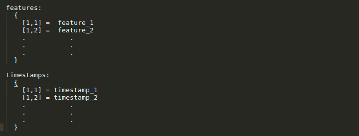 </p>
<div align="center"><i>Figure 5: Format of deparsing input file</i></div><br />

The timestamps in the deparsing input file must be specified with format "%Y-%m-%d %H:%M:%S". Internally, the timestamps will be converted to the timestamp format of every data source.


## 4. EXAMPLE

### 4.1. PARSING

An example with structured and unstructured sources can be found in the FCParser _example_ directory.
For this example, data sources are _netflow_ (structured data, in _csv_ file) and _ids_ logs (unstructured log entries, where one log each entry consists of a paragraph).

Fig. 6 shows the general configuration file for this example.  
<p align="center"> 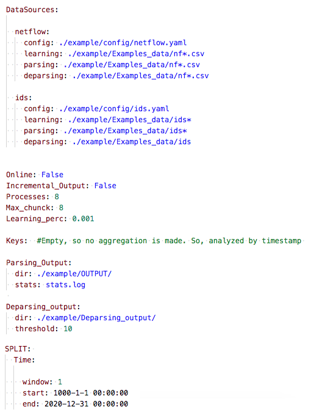 </p>
<div align="center"><i>Figure 6: Example - General configuration file</i></div><br />


In the upper part, the different data sources are specified (netflow and IDS), including the data directory and the path where data source configuration file is located. Keys field is unused, aggregation is not performed and observations will then be grouped by timestamp.
At the end of the file, we can find the configuration for temporal sampling. In this case, the sampling rate is one minute.

Let's see now what the data looks like so that we can specify the configuration files for these data sources.
So, for netflow data, we can find the data file (nf.csv) in the Examples_data directory and netflow configuration file in the config directory (netflow.yaml). If we take a look at the data, it consists of comma separated values where every line is an entry.

An example of the structure of some entries (lines) is depicted in Figure 7:  

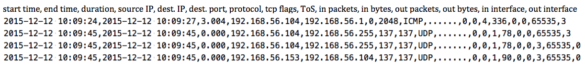
<div align="center"><i>Figure 7: Example - Netflow datasource</i></div><br />
Based on this structure, we can create our data source configuration file, where the attributes, variables and features will be defined according to our goals:<br />  


<p align="center"> 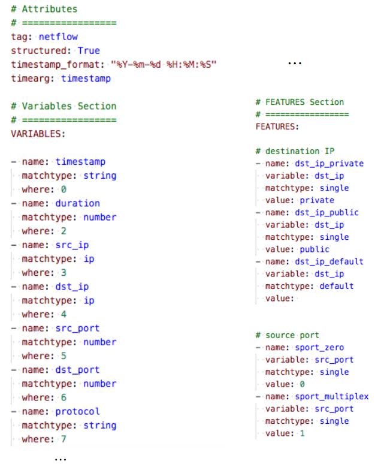 </p>
<div align="center"><i>Figure 8: Example - Netflow configuration file</i></div><br />
In figure 8, we can see a fragment of the configuration file for a _netflow_ data source.
It shows the mandatory attributes for structured sources. As we mentioned before, timearg attribute represents the instant at which a certain event occurred, and it is defined by means of the timestamp variable. The _where_ value of the timestamp variable matches the position in the entry line (i.e. zero because the first field of every entry log corresponds with the time instant). Timestamp format is also specified according to the data file.<br />  
For more information about the timestamp format, check: https://docs.python.org/2/library/datetime.html#strftime-and-strptime-behavior

<br />In the case of IDS data source, the data file in Examples_data directory is named _ids.log_ and IDS configuration file in the config directory is named _ids.yaml_.

In Figure 9, we can see an example of unstructured data, where each log entry consists of a paragraph.
<p align="center"> 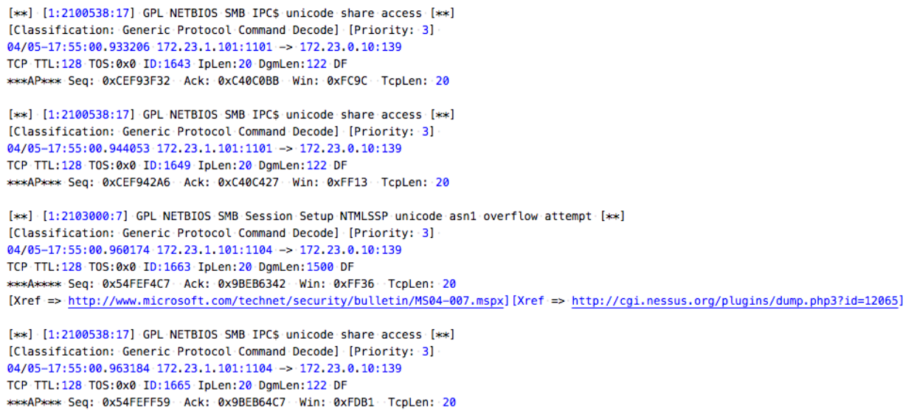 </p>
<div align="center"><i>Figure 9: Example - IDS log entries</i></div><br />


In Figure 10, an unstructured source configuration file is depicted, where some variables and features are defined using regular expressions. When building the IDS config file, we can notice that it differs from netflow in that regular expressions are now needed to extract the data. These regular expressions are used to search variables in the log entries, including the timestamp variable. You can check if the regular expressions are properly defined by running fcparser in debugging mode and checking if the data is being parsed correctly into the defined variables (none values will result if a regular expression does not match the data, as it was shown in chapter 4).
<p align="center"> 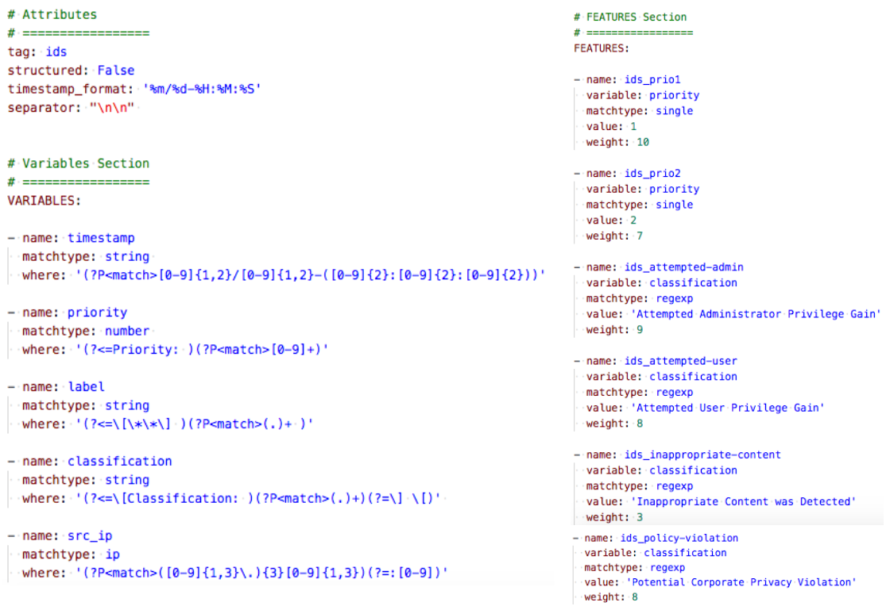 </p>
<div align="center"><i>Figure 10: Example - IDS configuration file</i></div><br />

For this case, it is necessary to define the separator between entries (two blank lines). We can also see the definition of the variables and some features in the figure, for which differents weights are assigned. Using these weight values will be useful for the deparsing process.


In order to run the example and parse the data, just run the following command in the FCParser directory:

    $ python3 bin/fcparser.py example/config/configuration.yaml

<p align="center"> 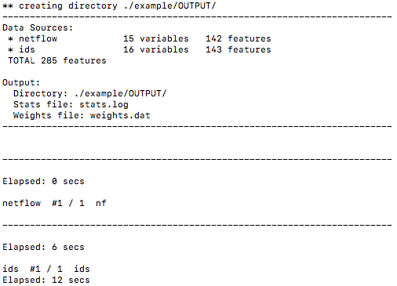 </p>
<div align="center"><i>Figure 11: Example output - Parsing data</i></div><br />

The parser output consists of:
- The stats file, which includes number of variables, features, data size and logs and processed logs:
<p align="center"> 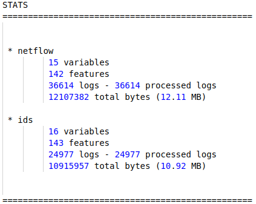 </p>
<div align="center"><i>Figure 12: Example output - Stats file</i></div><br />
In this case all the lines have been processed but sometimes the number of logs and processed logs will differ (eg. if there are some logs with invalid timestamp or empty lines).<br />

- The header file, with a list of the features from all data sources:
<p align="center"> 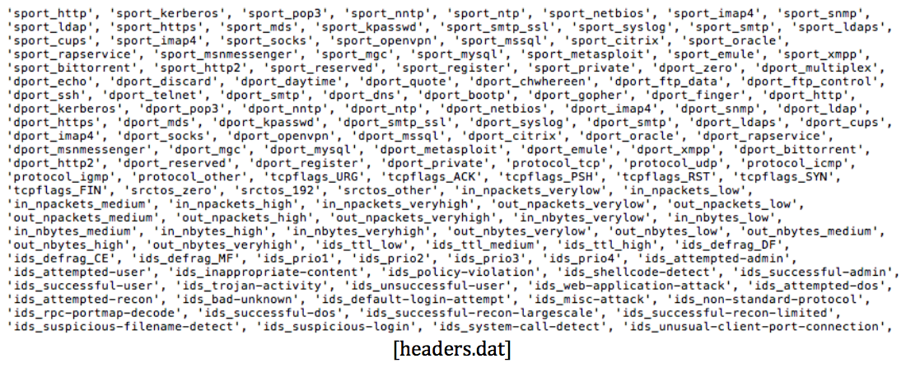</p>
<div align="center"><i>Figure 13: Example output - Headers file</i></div><br />
  Where the 143 ids feature names are concatenated after the 142 netflow feature names.</p>

- The weights file, which includes the weight associated to each feature. If a feature has no weight defined in configuration file, weight is automatically set to one, as depicted in the next figure:
<p align="center"> 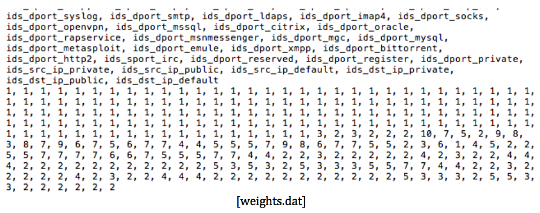 </p>
<div align="center"><i>Figure 14: Example output - Weights file</i></div><br />


- The parsed data with the timestamp in the file name (output-yyyymmddhhmm.dat).
As time window was set to one minute, the number of files generated will match the number of minutes for which we have records.

The structure of these files look as depicted:
<p align="center"> 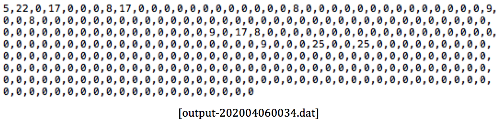 </p>
<div align="center"><i>Figure 15: Example output - Parsed data (feature counters)</i></div><br />
Where the number of times a given event (feature) occurs is recorded as comma-separated values, for each of the 285 features.

In case we define some keys in general configuration file, eg. 'Keys: src_ip', then counters are broken down according to the variable src_ip for each defined time interval. In the next picture we can see an example fragment for timestamp 201212121030:
<p align="center"> 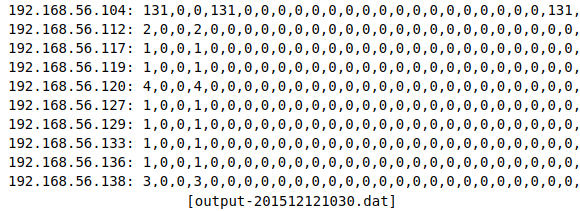 </p>
<div align="center"><i>Figure 16: Example output - Parsed data using keys</i></div><br />


### 4.2. DEPARSING

The _deparsing_ process uses the same configuration files used before. Using both
detection and diagnosis information, the original raw data records related to anomaly
are identified and presented to the analyst. Detection and diagnosis information is
specified in the _deparsing_ input file.

An example of deparsing input file is depicted in figure 17:
<p align="center"> 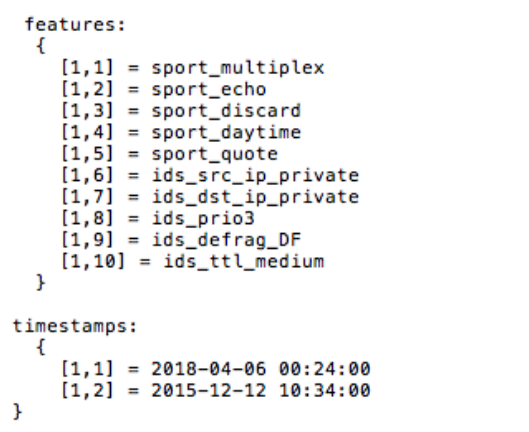 </p>
<div align="center"><i>Figure 17: Example - Deparsing input file</i></div><br />

To run the program, use the following command:

	$ python3 bin/fcdeparser.py example/config/configuration.yaml example/deparsing_input

Then, the timestamps and features defined in the deparsing input file are searched for each data source, and a list is generated with the number of logs matching that criteria along with the number of features found for each case. According to the specified threshold, logs with more matched features will be selected. If no threshold is defined, all logs with at least one matched feature will be deparsed.
There is also the possibility to not define timestamps in deparsing input file. In that case, the logs will only be selected by the number of matched features. 

<p align="center"> 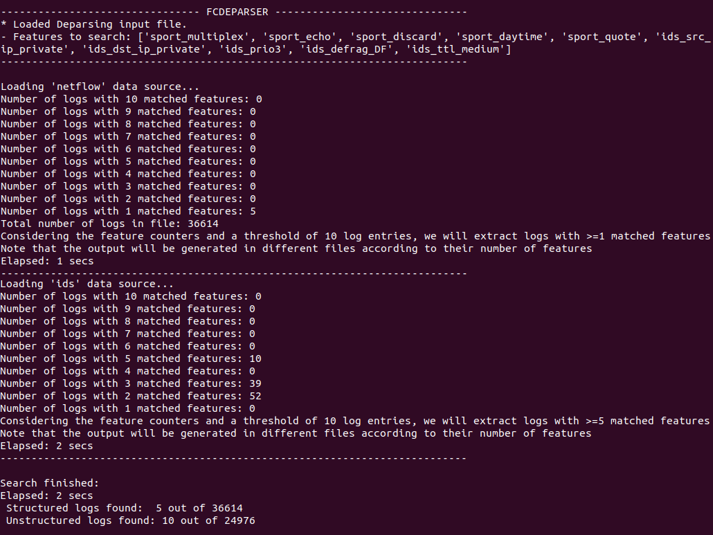 </p>
<div align="center"><i>Figure 18: Example - Deparser terminal</i></div><br />

The _deparsing_ program generates one file for each number of found features (for each data source) with the extracted logs
related to the anomalies detected, as well as the stats file with the number of structured and unstructured logs deparsed.
Thus, the output files are named as: _output_sourcename_Xfeat_, where X is the number of matched features.
Within each file, the logs are ordered according to their order of appearance in the data file.

<p align="center"> 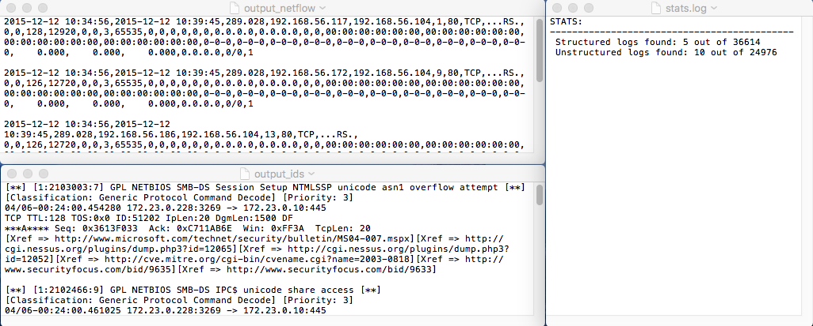 </p>
<div align="center"><i>Figure 19: Example - Deparsing output</i></div><br />


## 5. DEBUGGER

### 5.1 DEBUGGING PARSING PROCESS

Debugger execution mode has been implemented by running fcparser with -d (--debug) option. This mode allows us to process the data source line by line, showing how every log is being parsed into records (according to our defined variables), as well as generating the observation vector according to our defined features.
This way, if there is some mismatch between the log and the configuration file (eg. if the regular expression for a variable is not correct), we can detect and correct this mistakes by running this mode. For incorrectly parsed variables, their content is set to None and then highlighted by the debugger.\
Therefore, it is recommendable to run fcparser in debugging mode to check if the configuration files are correct before running the parsing process for the first time. 

When running the debugger, the data source is loaded and the number of logs in it is depicted.

    $ python3 bin/fcparser.py -d example/config/configuration.yaml

<p align="center"> 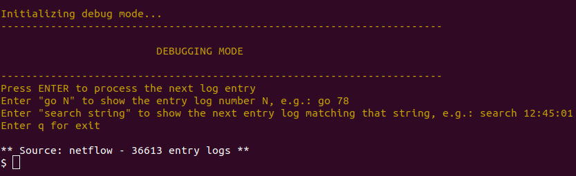 </p>
<div align="center"><i>Figure 20: Example - FCParser Debugging mode. Initialization message</i></div><br />


Then, a simple terminal is given to the user with two possibilites:
- To process the next log entry by pressing ENTER.
Then, the entry log, the parsed variables (records) and observation vector are printed. Also, the feature names for those features with non-zero counters are shown. In the next picture we can see a parsing example of an unstructured entry log.
<p align="center"> 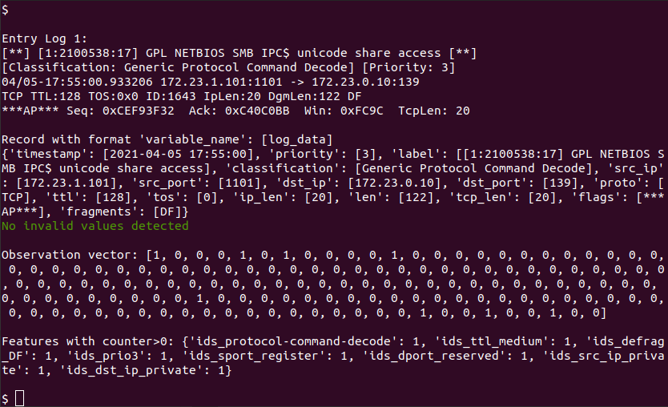 </p>
<div align="center"><i>Figure 21: Example - FCParser Debugger output</i></div><br />
At the top of the picture we can see the raw entry log and how it is parsed into variables. In the lower part of the figure, the observation counters for that entry log are depicted, ordered according to our defined features, along with the feature names of those non-zero counters. In this example, all non-zero counters are set to 1, but it is possible to have counters with higher values if the event (represented with that counter) occurs more than once in a entry log.</div><br />

- To process an specific log entry.
In this case, we can "jump" to a certain log by specifying the log entry number with go command, eg. "go 34" will show the entry log number 34 (which would correspond with the line 34 for structured sources). 
<p align="center"> 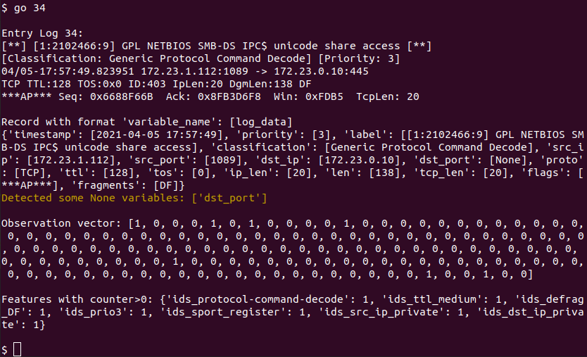 </p>
<div align="center"><i>Figure 22: Example - FCParser Debugger output. Unstructured source</i></div><br />
In this example, all the data is correctly parsed but dst_port variable, which is set to None. This happened because the regular expression used to define this variable was not properly defined. Also, online tools as [7] might help you to understand why a regular expression is not correct. </div><br />

Also, we can type some string with search command, and the debugger will then return the next entry log containing that string, eg. "search 10:15:45".
<p align="center"> 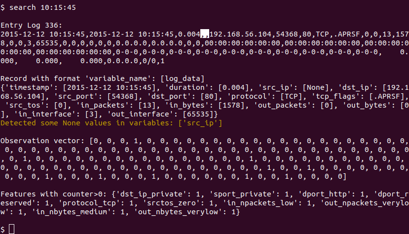 </p>
<div align="center"><i>Figure 23: Example - FCParser Debugger output. Structured source</i></div><br />
In this picture, we can see an example of a structured source (comma-separated value data), in which we use the search command to load directly the log entry with a certain timestamp. For structured sources, the variables are defined in order according to the different data fields. Eg: timestamp is the first field, then duration, source ip, etc.<br />
Sometimes, we can find malformed logs in which some of the fields are empty, as it happens in this example for src_ip variable. Then, this variable is set to None.  

This command is really useful if some errors are detected during the parsing process and we want to know why they did happen.

The program allows us to surf between all the entry logs by combining the presented functionalities. When reaching the end of the file, it is loaded again. In case you define two data sources in the configuration file, please note you can only process one data source when running in debug mode.
We can end the execution at any time by pressing the 'q' key.

### 5.2 DEBUGGING DEPARSING PROCESS

Analogously, a debugger execution mode was implemented in fcdeparser by executing it with -d (--debug) option. This mode allows us to follow the deparsing process in detail, by loading every log sequentially and showing which features are detected and what decision will the deparser take for that log.

    $ python3 bin/fcdeparser.py example/config/configuration.yaml example/deparsing_input -d

<p align="center"> 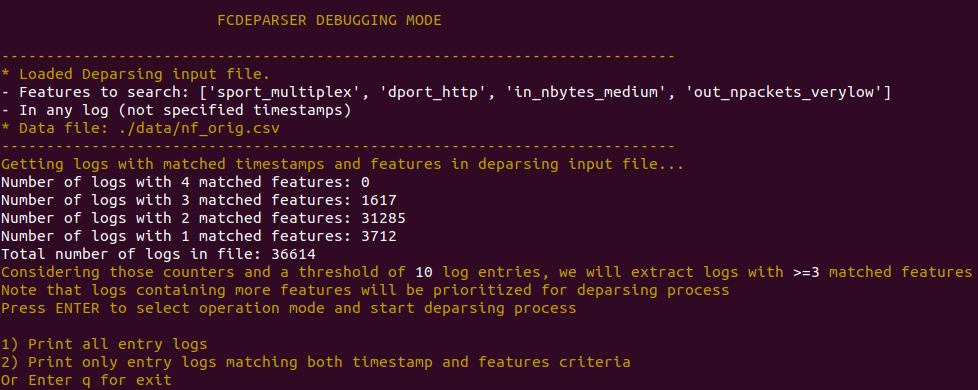 </p>
<div align="center"><i>Figure 24: Example - FCDeparser Debugging mode. Initialization message</i></div><br />

First, the features and timestamps from deparsing input file are loaded, and the program is searching for the number of logs matching this criteria. According to this search and the specified threshold (if any), the selection criteria is determined.

Then, the user will decide between two possible execution modes:

- To process every log sequentially from the beginning. In this case, the debugger will indicate if the log fulfill the criteria to be deparsed or not.
<p align="center"> 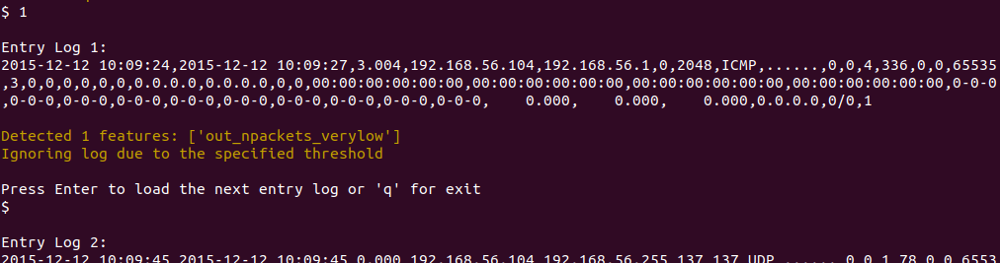 </p>
<div align="center"><i>Figure 25: Example - FCDeparser Debugger output. Mode 1</i></div><br />
The next log can be loaded by pressing ENTER or we can end the execution at any time by pressing the 'q' key. 


- To show only the logs that fulfill the deparsing criteria. Then, the program "jumps" to the selected logs that match the timestamp, the number of features and the threshold criteria.
<p align="center"> 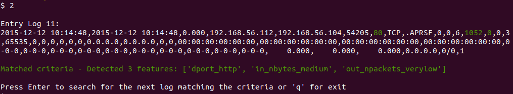 </p>
<div align="center"><i>Figure 26: Example - FCDeparser Debugging mode. Mode 2</i></div><br />
For these logs, the variable fields related to the matched features are highlighted in green color and the names of these matched features are printed in order (from left to right) according to their position in the log entry.
The next selected log can be loaded by pressing ENTER or we can end the execution at any time by pressing the 'q' key.


## 6. INSTALLATION REQUIREMENTS

FCParser is designed to work on UNIX system with python installed. Almost every
linux distribution come with python pre-installed. For library compatibility, python 3 is the required version.
If you are using an older version of Python, you might update your Python libraries or create a Python3 virtual environment using virtualenv, for example:

	$ virtualenv --python=python3 FCParser/env
	$ source FCParser/env/bin/activate

The program requires some python modules to work properly. Before using this tool,
install the following packages:

- Ipy – Python module for handling _IPv4_ and _IPv6_ addresses and networks [4]
    ```
    $ pip install IPy
    ```
- PyYAML – _YAML_ analyzer for python [5].
    ```
    $ pip install PyYAML
    ```
Nfdump [6]_._ In order to work with _netflow_ data in _nfcapd_ format, the _netflow_ processing
tool _Nfdump_ is required.


## REFERENCES

[1] Camacho, José & Pérez-Villegas, Alejandro & García-Teodoro, Pedro & Maciá-
Fernández, Gabriel. (2016). PCA-based multivariate statistical network monitoring for
anomaly detection. Computers & Security. 59.. 10.1016/j.cose.2016.02.008.

[2] Python datetime module for manipulating dates and times. Available at:
https://docs.python.org/2/library/datetime.html

[3] Camacho, J., Pérez, A., Rodríguez, R., Jiménez-Mañas, E. Multivariate Exploratory
Data Analysis (MEDA) Toolbox. Chemometrics and Intelligent Laboratory Systems,
2015, 143: 49-57, available at: https://github.com/josecamachop/MEDA-Toolbox

[4] _IPy_ , python module for handling of IPv4 and IPv6 addresses and networks.
Available at: https://pypi.python.org/pypi/IPy/

[5] _PyYAML_ , The next generation _YAML_ parser and emitter for Python. Available at:
https://pypi.python.org/pypi/PyYAML

[6] _NFDUMP_ , tools to collect and process _netflow_ data on the command line. Available
at: [http://nfdump.sourceforge.net/](http://nfdump.sourceforge.net/)

[7] _regex101_: build, test, and debug regex. Available at: https://regex101.com/


